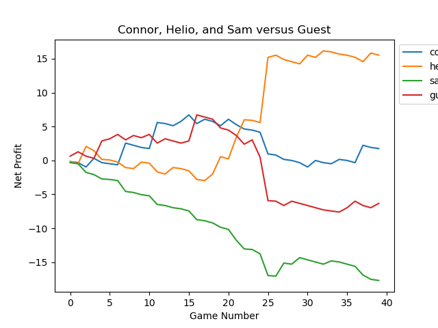

# Lifetime-Mahjong-Performance
Every friday I play mahjong with my friends for penny a point stakes. Here is out lifetime performance and payout data. 

## Rules
We play MCR rules with a few house rules that add some scoring rules

## Fan to Points

| Fan        | Points/Cents          | Nickname  |
| ------------- |:-------------:| -----:|
| 0 | 32 | Chicken Hand |
| 1 | 2  |  |
| 2 | 4  |  |
| 3 | 8  | Min-Hand |
| 4,5,6 | 16  |  |
| 7,8,9 | 32 |  |
| 10-15 | 64 |  |
| 16-23 | 80 |  |
| 24-43 | 160  |  |
| 44-63 | 240  |  |
| 64-87 | 360  |  |
| 88 | 500  | Limit Hand |

## Current Performance 

